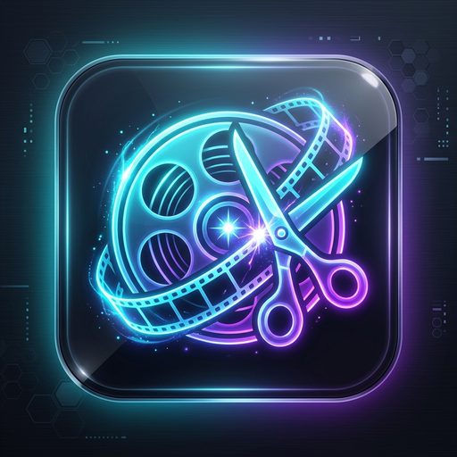
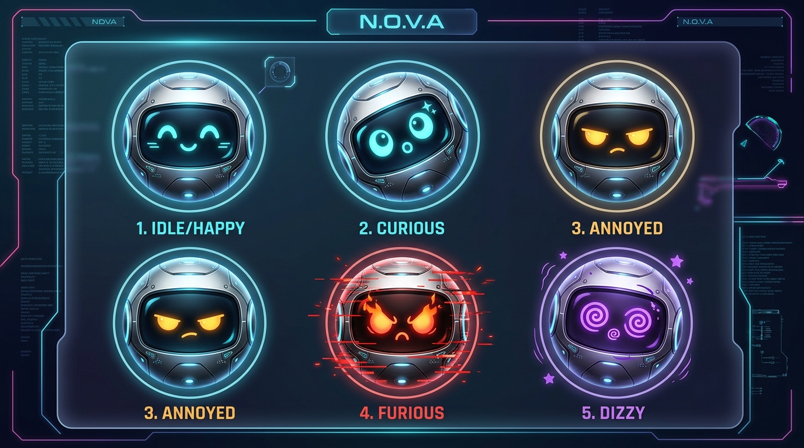
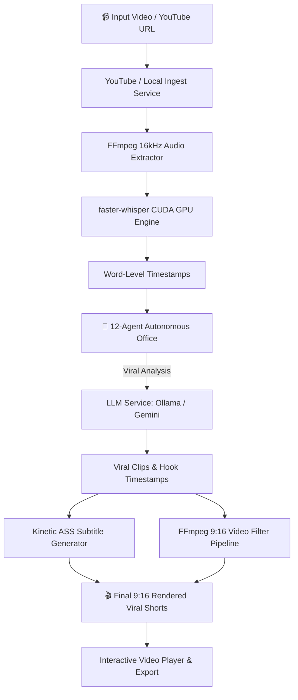

<div align="center">



# 🎬 AutoClip Studio AI
### *Autonomous 3D AI Media Agency & Viral Shorts Cinema Engine*

[](LICENSE)
[](https://www.electronjs.org/)
[](https://react.dev/)
[](https://threejs.org/)
[](https://vitejs.dev/)
[](https://ollama.ai)
[](https://developer.nvidia.com/cuda-zone)

**Transform long-form videos into viral, high-retention 9:16 Shorts & Reels with a single click.**  
Powered by an **interactive 3D isometric office with 12 autonomous AI agents**, local GPU Whisper transcription, and TikTok-style kinetic subtitles.

[Key Features](#-key-features) • [3D Agent Agency](#-the-12-agent-autonomous-agency) • [Architecture](#-architecture) • [Getting Started](#-getting-started) • [Tech Stack](#-tech-stack)

---

</div>

## 🌟 Key Features

### 🏢 1. Interactive 3D Autonomous AI Studio (Three.js)
- **Living 3D Isometric Office**: Powered by Three.js and TWEEN animations, watch 12 specialized AI agents collaborate in real-time.
- **Holographic Strategy Table**: When an operation begins, agents transition to the central round holographic table for team debriefing.
- **Dynamic Speech Bubbles & Lighting**: Real-time monitor backlights, agent speech bubbles, hover states, and smooth orbital camera controls.

### 🎙️ 2. GPU-Accelerated Word-Level Deconstruction
- **faster-whisper + NVIDIA CUDA**: Transcribes hours of video in minutes with millisecond-accurate word timestamps (`word_timestamps=True`).
- **Zero Cloud Dependence**: 100% private, local speech-to-text with real-time GPU telemetry.

### 🧠 3. Dual-Brain Viral Intelligence
- **Local Ollama or Cloud Gemini**: Plug in Ollama (`llama3.2`, `qwen2.5`, `deepseek-r1`) or Google Gemini Flash (`gemini-2.5-flash`).
- **Hook Detection & Retention Scoring**: Analyzes opening hooks, sentiment trajectory, dopamine curves, and viral readiness (0-100 score).
- **Context-Aware Dynamic Titles**: Generates viral hook titles tailored to the actual spoken dialogue.

### ⚡ 4. Kinetic TikTok & Reels Subtitle Engine
- **Advanced SubStation Alpha (.ass)**: Studio-grade karaoke word-by-word color reveals with high-contrast outlines and drop shadows.
- **Viral Presets**: Includes MrBeast, Alex Hormozi, Neon Cyan, and Cyberpunk typography presets with custom font scaling.

### 🎬 5. Smart 9:16 Auto-Reframing
- **Cinematic Blurred Background (`boxblur`)**: Keeps full 16:9 context centered while filling vertical space with a smooth blurred mirror.
- **Center Focus & Face Detection**: Optional face-tracking framing for high-retention conversational clips.

### 📥 6. Built-in YouTube & Shorts Downloader
- **Speed & Telemetry**: Live progress bar, downloaded MB / Total MB, download speed, and ETA calculation.
- **Resolution Selector**: Choose from 1080p, 720p, 480p, or best available format.
- **Smart Fixes**: Automatic IPv4 forcing and JS runtime fallbacks for instant download initiation.

### 🤖 7. Interactive NOVA Copilot & Living Emotional Avatar
<div align="center">
  
</div>

- **Physics-Based Gaze Tracking (Spring-Damper LERP)**: NOVA's robotic pupils and head tilt follow your mouse cursor smoothly across the entire screen.
- **Poke & Annoyance Engine**:
  - **1-2 Pokes**: Happy smile (`^_^`), playful neon cyan glow & friendly voice greetings.
  - **3-4 Pokes**: Irritated side-eye (`ಠ_ಠ`), amber warning aura & witty protests (*"Working here boss, stop tickling!"*).
  - **6+ Pokes**: Furious flaming eyebrows (`>_<`), red glitch vibration, screen shake & fiery vocal outbursts.
- **Dizzy & Sleep States**: Rapidly shaking your cursor triggers dizzy swirling eyes (`@_@`), while 45s of user inactivity puts NOVA into a soft glowing snooze with `Zzz` floating bubbles.
- **Desktop Dynamic Dock**: Minimalist floating island overlay with voice synthesis, 5-stage progress pipeline tree, and instant error dismissals.

---

## 👥 The 12-Agent Autonomous Agency

| Pod | Agent | Model | Specialized Role |
| :--- | :--- | :--- | :--- |
| **Pod 1 (Scouting & Vision)** | **Hunter Gemma** | Gemma 2B | Scans trends, identifies initial peak energy moments |
| | **Legal Llama** | Llama 3.2 | Copyright guard, compliance & safe-use checker |
| | **Scout Gemma** | Gemma 2B | Deep keyword scanning & search intent match |
| | **Director Qwen** | Qwen 2.5 | Frame composition, pacing & retention director |
| | **Vision Qwen-VL**| Qwen 2.5-VL | Visual anchor detection & face-tracking validation |
| | **Copy Qwen** | Qwen 2.5 | Viral captions, punchlines & video descriptions |
| **Pod 2 (Production & Growth)**| **Auditor Llama** | Llama 3.2 | Sentinel audit, quality assurance & subtitle sync |
| | **Planner Qwen** | Qwen 2.5 | Content roadmap & clip sequencing strategist |
| | **Hook Master** | Llama 3.2 | 0-3s high-retention opening hook architect |
| | **SEO DeepSeek** | DeepSeek R1 | Hashtags, algorithmic metadata & discoverability |
| | **Audio Maestro** | Qwen 2.5 | Sound balance, vocal prominence & background ducking |
| | **Global Polyglot**| Qwen 2.5 | Multi-language translation & localized subtitles |

---

## 🏗️ Architecture



---

## 🚀 Getting Started

### Prerequisites
- **Node.js**: v18.0.0 or higher
- **NPM**: v9.0.0 or higher
- **Python**: 3.10+ (for `faster-whisper`)
- **FFmpeg**: Installed and in PATH (or GyanD build)
- **NVIDIA GPU** *(Recommended for CUDA Whisper speed)*

### Installation

1. **Clone the repository:**
   ```bash
   git clone https://github.com/Tolgakabadayi/auto-clip-studio.git
   cd auto-clip-studio
   ```

2. **Install frontend and Electron dependencies:**
   ```bash
   npm install
   ```

3. **Install Python transcription dependencies:**
   ```bash
   pip install faster-whisper torch
   ```

### Running the App

- **Development Mode (Vite + Electron):**
  ```bash
  npm run dev
  ```
- **Silent Background Mode (Windows):**
  Double click [`AutoClip_Sessiz_Baslat.vbs`](AutoClip_Sessiz_Baslat.vbs) or [`start.bat`](start.bat) to launch with zero terminal windows.

- **Build Standalone Windows `.exe` & Setup Installer:**
  ```bash
  npm run electron:build
  ```
  The built installer will be generated in `release/AutoClip Studio AI Setup 1.0.0.exe`.

---

## 💻 Tech Stack

- **Desktop Framework**: [Electron 33](https://electronjs.org/)
- **UI Framework**: [React 18](https://react.dev/), [TypeScript](https://www.typescriptlang.org/)
- **Styling**: [Tailwind CSS 3](https://tailwindcss.com/), Glassmorphism Dark Theme
- **3D Engine**: [Three.js r186](https://threejs.org/) with [@tweenjs/tween.js](https://github.com/tweenjs/tween.js)
- **Build Tool**: [Vite 6](https://vitejs.dev/) with `vite-plugin-electron`
- **Speech-to-Text**: `faster-whisper` (CTranslate2 + NVIDIA CUDA)
- **Video Engine**: `FFmpeg` (Custom 9:16 filter graph & ASS subtitling)
- **AI Runtimes**: [Ollama](https://ollama.ai) (Local) & [Google Gemini 2.5 Flash API](https://ai.google.dev/)
- **Packager**: [electron-builder 25](https://www.electron.build/) (NSIS Installer)

---

## 🤝 Contributing

Contributions, issues, and feature requests are welcome!  
Feel free to check out the [issues page](https://github.com/Tolgakabadayi/auto-clip-studio/issues).

1. Fork the Project
2. Create your Feature Branch (`git checkout -b feature/AmazingFeature`)
3. Commit your Changes (`git commit -m 'feat: Add AmazingFeature'`)
4. Push to the Branch (`git push origin feature/AmazingFeature`)
5. Open a Pull Request

---

## 📜 License

Distributed under the **MIT License**. See `LICENSE` for more information.

<div align="center">
<sub>Crafted with ❤️ for content creators, agencies, and AI visionaries.</sub>
</div>
